# 주식 거래 시스템 설계 작업 플로우

## 전체 작업 흐름

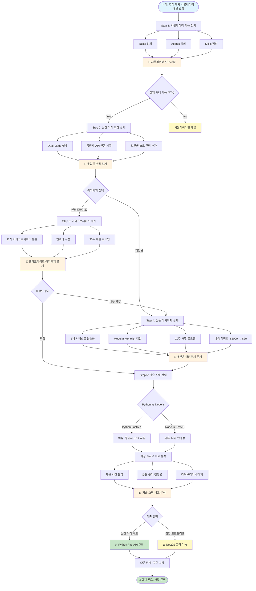

---

## 각 단계별 상세 플로우

### Step 1: 시뮬레이터 기능 정의

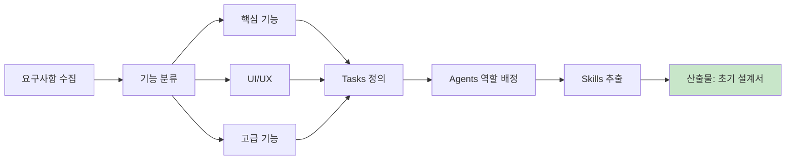

---

### Step 2: 실전 거래 확장

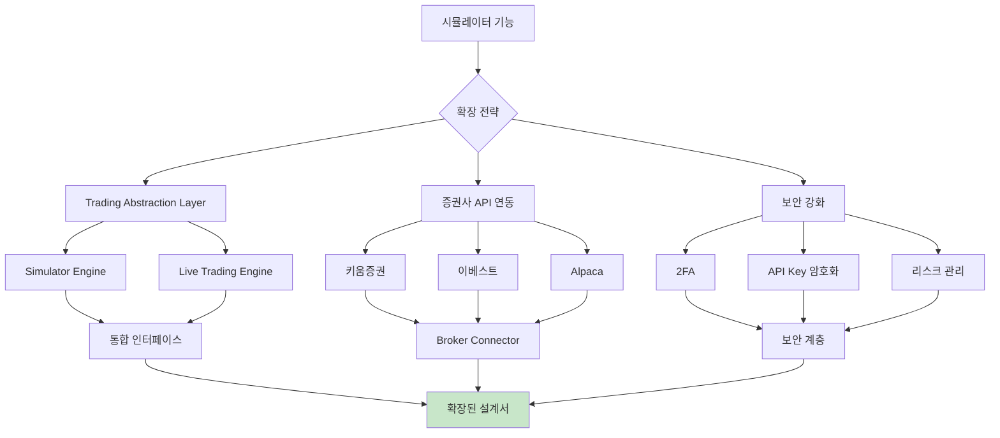

---

### Step 3: 마이크로서비스 아키텍처

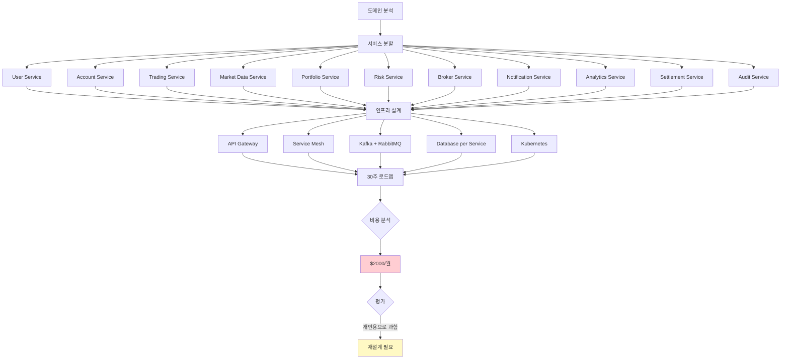

---

### Step 4: 심플 아키텍처로 재설계

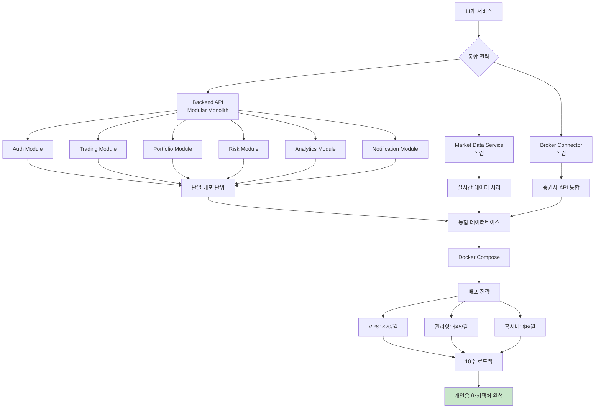

---

### Step 5: 기술 스택 비교

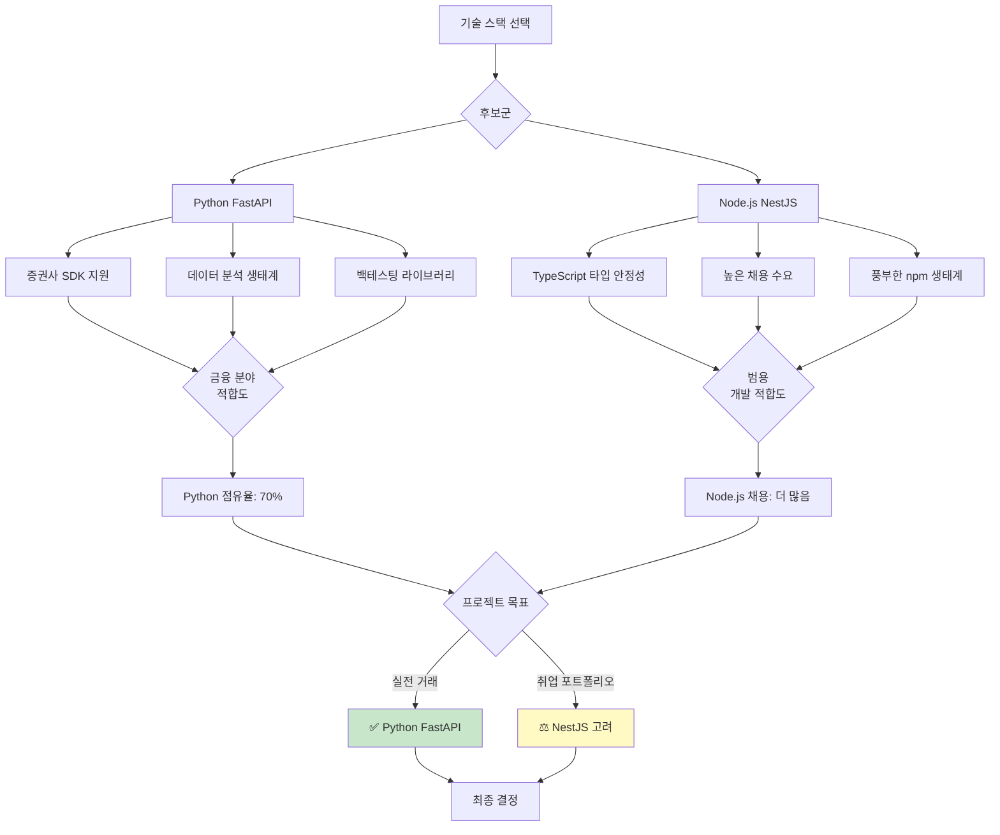

---

## 의사결정 트리

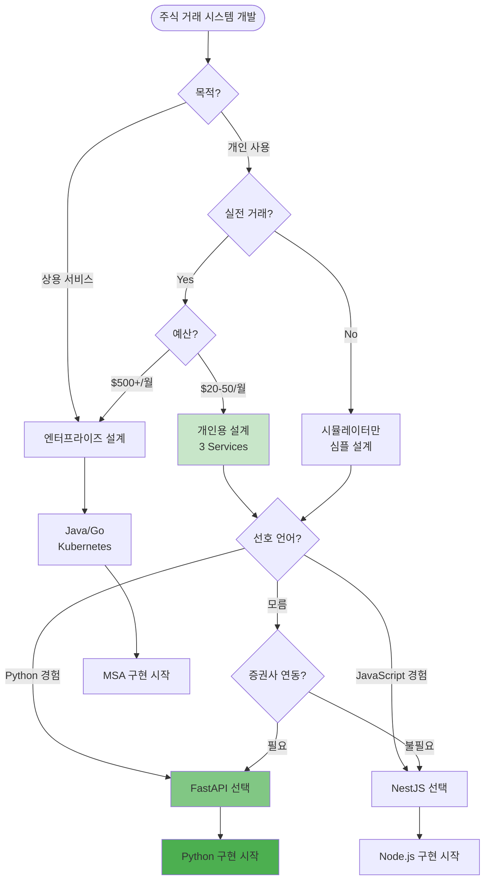

---

## 산출물 요약

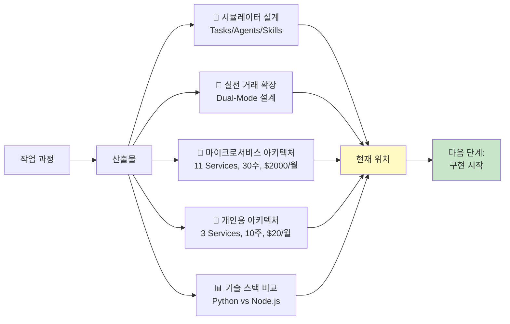

---

## 타임라인

```mermaid
gantt
    title 설계 작업 타임라인
    dateFormat HH:mm
    axisFormat %H:%M

    section 요구사항 분석
    시뮬레이터 기능 정의    :done, req1, 00:00, 30m
    Tasks/Agents/Skills     :done, req2, 00:30, 30m

    section 기능 확장
    실전 거래 기능 추가      :done, exp1, 01:00, 40m
    보안/리스크 설계        :done, exp2, 01:40, 20m

    section 아키텍처 설계
    마이크로서비스 설계     :done, arch1, 02:00, 60m
    개인용 재설계          :done, arch2, 03:00, 50m

    section 기술 선택
    기술 스택 비교         :done, tech1, 03:50, 40m
    최종 추천             :done, tech2, 04:30, 20m

    section 문서화
    플로우차트 작성        :active, doc1, 04:50, 30m
```

---

## 핵심 의사결정 포인트

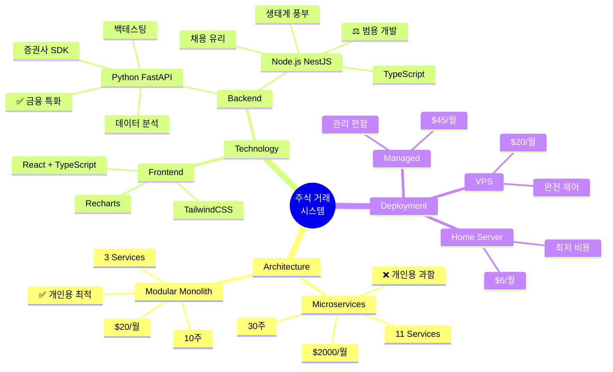

---

## 다음 단계 로드맵

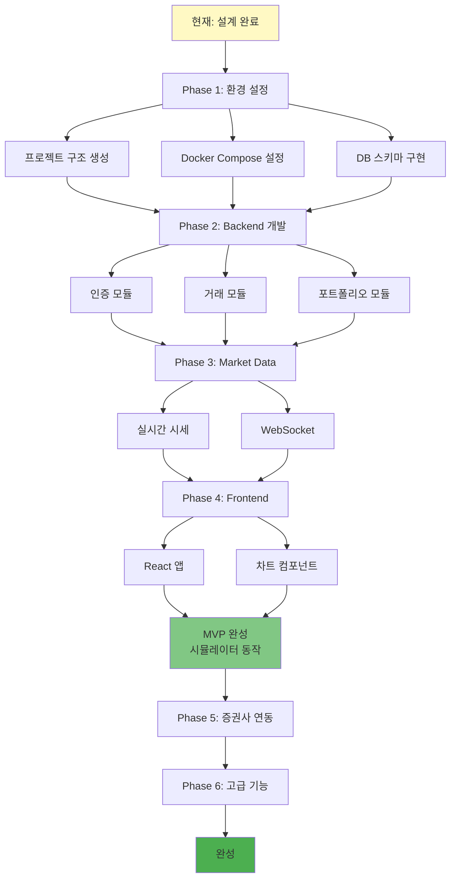

---

## 프로젝트 구조 (최종)

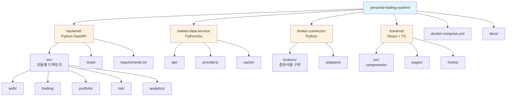

---

## 요약: 작업 과정

1. **Step 1**: 시뮬레이터 기능 정의 → Tasks, Agents, Skills 도출
2. **Step 2**: 실전 거래 확장 → Dual-Mode 설계, 보안 강화
3. **Step 3**: 마이크로서비스 설계 → 11개 서비스, 복잡도 높음 ❌
4. **Step 4**: 개인용 재설계 → 3개 서비스, 비용/시간 90% 절감 ✅
5. **Step 5**: 기술 스택 선택 → Python (금융 특화) vs Node.js (범용)

**현재 상태**: 설계 완료, 구현 준비 완료
**다음 단계**: 개발 환경 설정 및 구현 시작
